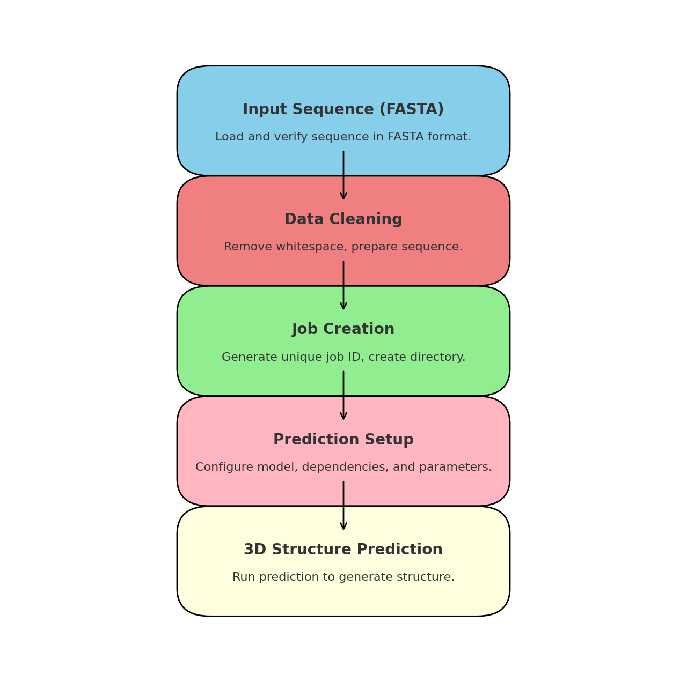
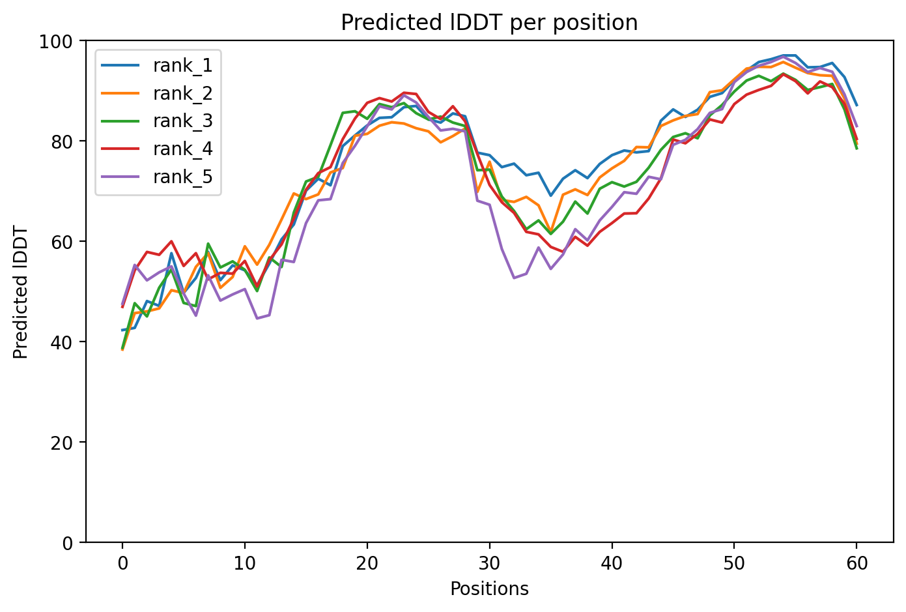
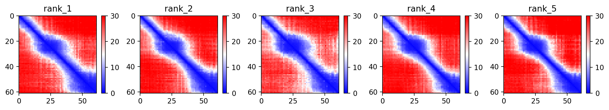
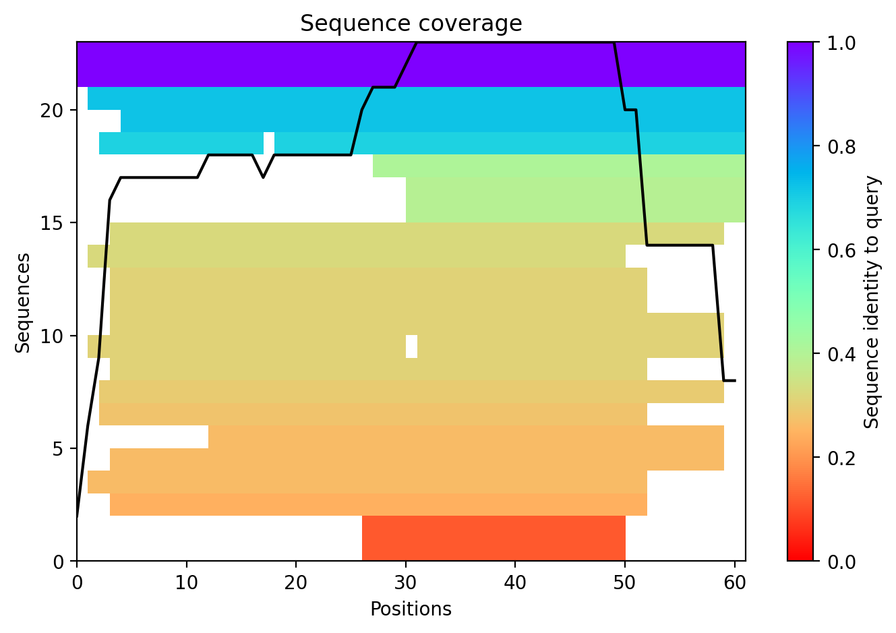

# 3D Protein Structure Prediction using AlphaFold (via ColabFold)

This project predicts the 3D structure of a protein from its amino acid sequence using **AlphaFold2**, powered by the **ColabFold** notebook interface. It simplifies the traditionally complex protein folding pipeline by offering fast, accurate predictions in a Colab environment — requiring only a FASTA sequence as input.

---

## Project Goal

To predict the 3D structure of a protein using deep learning-based inference and visualize model confidence across predicted atomic positions.

---

## Tools & Frameworks

- **ColabFold**: Google Colab interface to AlphaFold2 (via MMseqs2)
- **AlphaFold2**: DeepMind’s protein structure prediction model
- **JAX / NumPy / Matplotlib** for visualization
- **PyMOL / ChimeraX** (optional) for 3D rendering

---

## Repository Structure

```
alphafold-structure-prediction/
├── input/
│   └── uniparc_active_p1.fasta           # Protein sequence input file
│
├── notebook/
│   └── struct_prediction.ipynb                # ColabFold notebook (used for prediction)
│
├── results/
│   ├── ProteinStructPrediction_5993e_plddt.png     # Per-residue confidence (IDDT)
│   ├── ProteinStructPrediction_5993e_pae.png       # Pairwise alignment error heatmap
│   ├── ProteinStructPrediction_5993e_coverage.png  # Sequence coverage plot
│   └── workflow.png                                 # Visual workflow (pipeline)
│
├── README.md
└── LICENSE
```

---

## 🔬 Prediction Workflow

The following diagram summarizes the core prediction pipeline:



1. **Input Sequence**: A FASTA format protein sequence is loaded.
2. **Data Cleaning**: Whitespace and formatting are verified.
3. **Job Creation**: A job ID and folder structure are created.
4. **Prediction Setup**: Parameters and dependencies are configured.
5. **3D Structure Prediction**: AlphaFold2 generates ranked models and confidence scores.

---

## 📊 Key Output Visualizations

### IDDT per Position


### Pairwise Alignment Error (PAE)


### Sequence Coverage


---

## How to Run

1. Open the notebook [`struct_prediction.ipynb`](notebook/struct_prediction.ipynb) in Google Colab.
2. Upload your protein sequence in FASTA format.
3. Run all cells to get structure prediction and plots.
4. (Optional) Download `.pdb` files and visualize in PyMOL/ChimeraX.

---

## Notes

- This project uses default ColabFold settings and MMseqs2 for MSA generation.
- The input protein is hypothetical and truncated for speed.
- All intermediate JSON/PDB files are excluded to keep the repo clean.

---

## License

MIT License — see [`LICENSE`](./LICENSE) for details.
